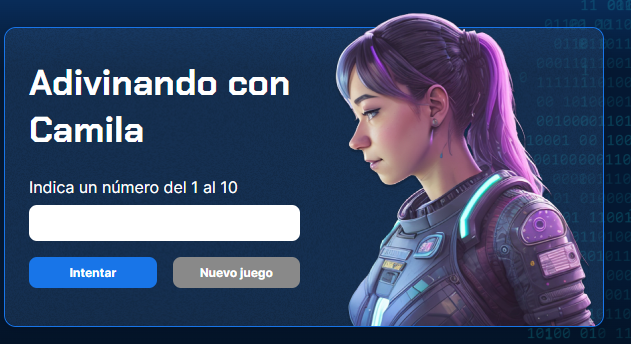

<h1 align= "center" style="color:purple">Juego secreto</h1>

 Juego para adivinar un número del 1 al 10

  <a href="#tecnologias" style="color:purple">Tecnologias</a>&nbsp;&nbsp;&nbsp;|&nbsp;&nbsp;&nbsp;
  <a href="#projeto" style="color:purple">Proyeto</a>&nbsp;&nbsp;&nbsp;|&nbsp;&nbsp;&nbsp;
  <a href="#link" style="color:purple">Link</a>

## 💻 Tecnologias 

Este proyecto fue realizado con las siguientes tecnologías:

- HTML y CSS
- JavaScript
- Github

## 📝 Proyecto
Juego realizado con el objetivo de aplicar la logica de programación aprendida con Alura latam, en el cual puedes intentar adivinar el número secreto que puede ser del 1 al 10.

## 🔗 Link
Pueden visualizar el proyecto através [DEL LINK](https://camilavildoso.github.io/JuegoSecreto/).